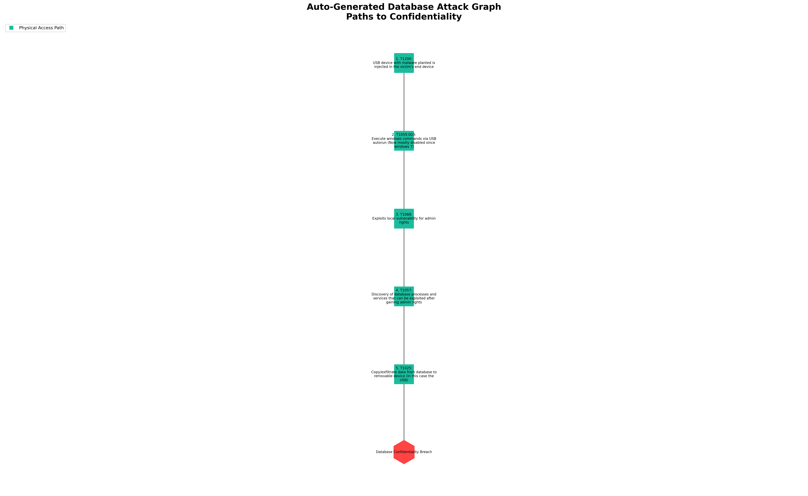

# MITRE ATT&CK Flow Generator

A Python tool that generates visual attack flow diagrams based on the MITRE ATT&CK framework. This tool helps cybersecurity professionals visualize and understand attack paths targeting different assets and security properties.



## Features

- **Multi-Asset Support**: Generate attack flows for databases and web applications
- **Security Property Analysis**: Focus on confidentiality, integrity, or availability impacts
- **Visual Attack Graphs**: High-quality PNG visualizations with professional styling
- **MITRE ATT&CK Integration**: Comprehensive database of real-world attack techniques
- **Interactive CLI**: User-friendly command-line interface with guided prompts
- **JSON Export**: Machine-readable graph data for integration with other tools
- **Customizable Output**: Multiple label modes, compact layouts, and styling options

## Supported Attack Scenarios

### Database Attacks

**Confidentiality Breaches:**

- SQL Injection Attack Flows
- Credential Theft Campaigns
- Insider Threat Scenarios
- Supply Chain Compromises
- Backup System Exploitation
- Physical Access Attacks

**Integrity Compromises:**

- Stored Data Manipulation
- Backup Restoration Poisoning
- ETL Pipeline Tampering
- Audit Log Bypass Techniques
- Replication Channel Abuse

### Web Application Attacks

**Integrity Impacts:**

- External/Internal Defacement
- Runtime Data Manipulation
- Cache Poisoning Attacks
- Authentication Process Tampering
- Supply Chain Widget Compromises

**Confidentiality Breaches:**

- Session Hijacking Campaigns
- Token Forgery Attacks
- Client-Side Data Harvesting
- API Abuse Scenarios

## Technical Stack

- **Python 3.7+**
- **NetworkX**: Graph generation and analysis
- **Matplotlib**: High-quality visualization rendering
- **JSON**: Structured data export
- **Argparse**: Command-line interface

## Quick Start

### Interactive Mode

```bash
python attack_graph_generator.py
```

### Command Line Mode

```bash
# Generate all database confidentiality attacks
python attack_graph_generator.py -a database -s confidentiality

# Generate specific web application integrity attacks
python attack_graph_generator.py -a web_application -s integrity --attacks web_defacement_webshell stored_data_tampering

# Custom output with compact layout
python attack_graph_generator.py -a database -s integrity -o my_attack_graph --compact --label-mode full
```

### List Available Options

```bash
python attack_graph_generator.py --list
```

## Output Examples

The tool generates professional attack flow diagrams showing:

- **Attack progression paths** from initial access to final impact
- **MITRE ATT&CK technique mappings** with official IDs
- **Color-coded attack vectors** for easy visual distinction
- **Detailed step descriptions** for each technique
- **Hierarchical layout** showing attack complexity

### Generated Files

- `*.png` - High-resolution visualization (300 DPI)
- `*.json` - Machine-readable graph data with metadata

## Use Cases

- **Threat Modeling**: Visualize potential attack paths during system design
- **Security Training**: Educational material for cybersecurity awareness
- **Red Team Planning**: Attack simulation and penetration testing preparation
- **Risk Assessment**: Identify high-risk attack vectors for prioritized defense
- **Compliance Documentation**: Visual evidence of threat landscape understanding

## Command Line Options

```bash
usage: attack_graph_generator.py [-h] [-a {database,web_application}]
                                [-s {confidentiality,integrity,availability}]
                                [--list] [-o OUTPUT]
                                [--label-mode {short,id,name,full}]
                                [--hide-legend] [--compact]
                                [--attacks ATTACKS [ATTACKS ...]]

Generate MITRE ATT&CK attack flow graphs

optional arguments:
  -h, --help            show this help message and exit
  -a, --asset          Asset type to target
  -s, --security       Security property to compromise
  --list               List available asset types and security properties
  -o, --output         Output filename base (without extension)
  --label-mode         Node label style for visualization
  --hide-legend        Hide legend to reduce clutter
  --compact            Compact spacing and smaller labels
  --attacks            Specific attack paths to include
```

## Architecture

The tool uses a modular architecture with:

- **AttackGraphGenerator**: Core class managing MITRE techniques and path generation
- **Graph Builder**: NetworkX integration for attack flow construction
- **Visualization Engine**: Matplotlib-based rendering with professional styling
- **Export System**: JSON serialization for data portability

## Security Research Applications

This tool supports various cybersecurity research activities:

- **Vulnerability Assessment**: Map potential attack vectors
- **Defense Strategy**: Understand attack progression for better countermeasures
- **Incident Response**: Analyze attack patterns and attribution
- **Security Architecture**: Design systems with attack path awareness

## Future Enhancements

- Network infrastructure attack flows
- Cloud security scenarios
- IoT device attack patterns
- Advanced persistent threat (APT) modeling
- Integration with threat intelligence feeds

## Contributing

This tool was developed to advance cybersecurity research and education. Contributions for additional attack scenarios, MITRE technique updates, and visualization improvements are welcome.

## License

This project is for educational and research purposes in cybersecurity.

---

**Developed by Mazen Alhassan** 
